# 
🔥  PracticeLinear_Lab2  🔥

## 
♦️  Задание 3  ♦️

### 💠 Начальный треугольник
Состоит из 3-х пиков A, B, C следующим образом:
- `A(5, -5)`
- `B(4, 3)`
- `C(10, 5)`

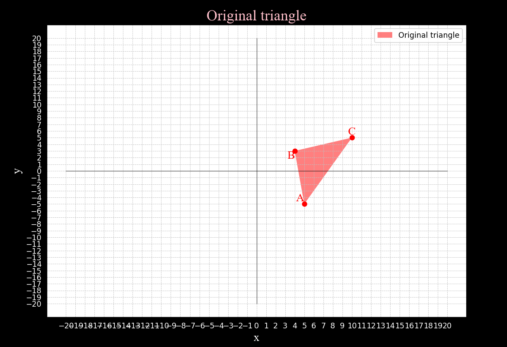

### 💠 Отображение 1: Отражение (симметрию) плоскости относительно прямой y = 2x.
🔸Cобственные векторы
-  `v1 = (1, 2)` 
-  `v2 = (-4, 2)`

🔸Преобразование

| Начальный треугольник | Треугольник после отображения |
|------------|------|
| `A(5, -5)` | `A'(-7, 1)` |
| `B(4, 3)`  | `B'(0, 5)`  |
| `C(10, 5)` | `C'(-2, 11)`|

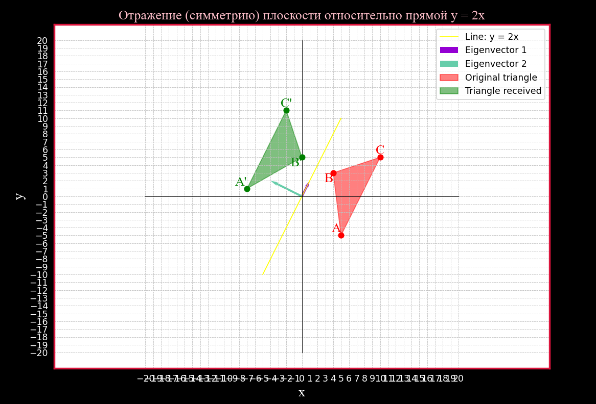

### 💠  Отображение 2: Отображение всей плоскости в прямую y = -2x.
🔸Преобразование

| Начальный треугольник | Треугольник после отображения |
|------------|------|
| `A(5, -5)` | `A'(-5/2, 5)` |
| `B(4, 3)`  | `B'(5, -10)`  |
| `C(10, 5)` | `C'(10, -20)` |

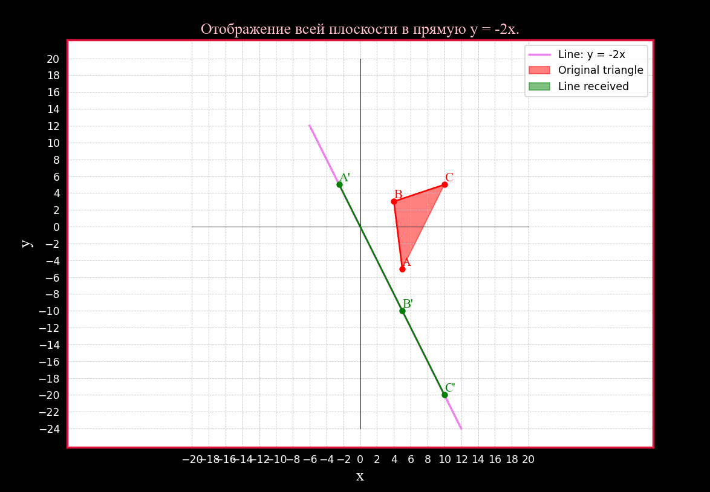

### 💠 Отображение 3: Поворот плоскости на 90 градусов против часовой стрелки.
🔸Преобразование

| Начальный треугольник | Треугольник после отображения |
|------------|------|
| `A(5, -5)` | `A'(5, 5)`   |
| `B(4, 3)`  | `B'(-3, 4)`  |
| `C(10, 5)` | `C'(-5, 10)` |

### 💠 Отображение 4: Центральную симметрию плоскости относительно начала координат.
🔸Преобразование

| Начальный треугольник | Треугольник после отображения |
|------------|------|
| `A(5, -5)` | `A'(-5, 5)`   |
| `B(4, 3)`  | `B'(-4, -3)`  |
| `C(10, 5)` | `C'(-5, -10)` |

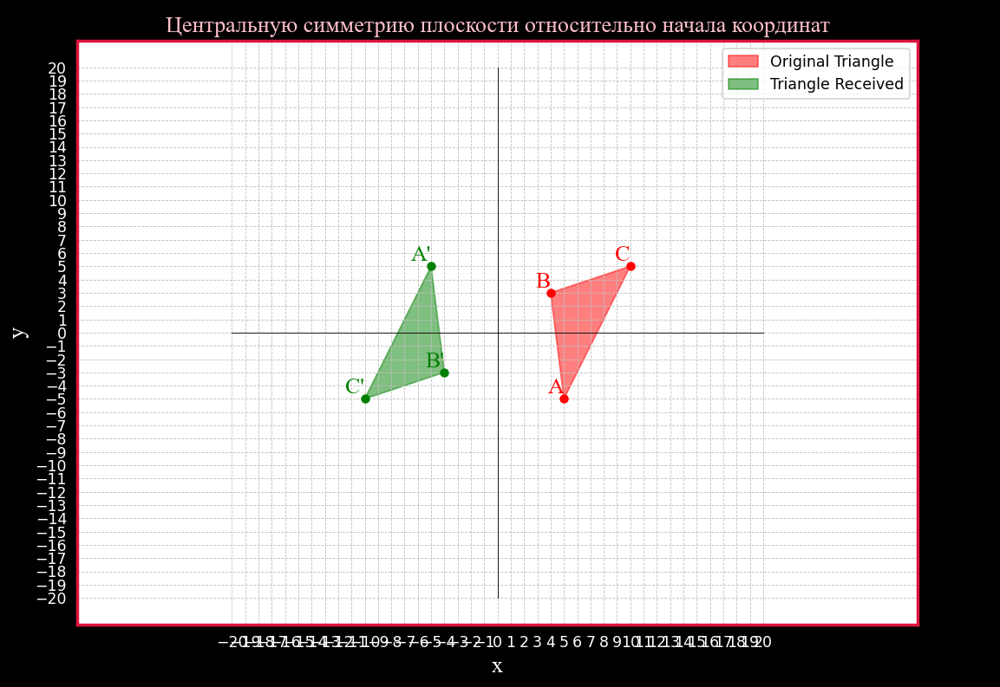

### 💠 Отображение 5: Отображение, которое можно описать так: сначала отражение относительно прямой y = 2x, потом поворот на 60 градусов по часовой стрелке.
🔸Преобразование

| Начальный треугольник | Черный треугольник после первого отображения | Зеленый треугольник после второго отображения|
|------------|------|------|
| `A(5, -5)` | `A'(-7, 1)`  | `A*() `|
| `B(4, 3)`  | `B'(0, 5)`   | `B*()` |
| `C(10, 5)` | `C'(-2, 11)` | `C*()` |

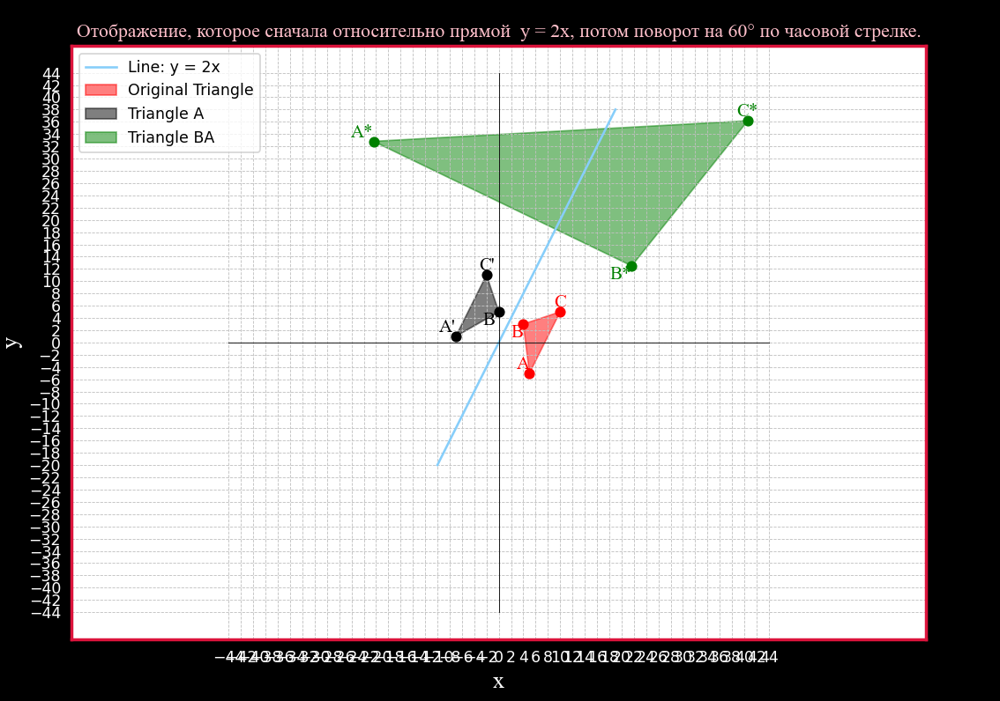

### 💠 Отображение 6: Отображение, которое переводит прямую y = 0 в y = 2x и прямую x = 0 в y = -2x.
🔸`y = 2x` - Зереный 

🔸`y = -2x` - Синий 

🔸Преобразование

| Начальный треугольник | Треугольник после отображения |
|------------|------|
| `A(5, -5)` | `A'(5, 5)`   |
| `B(4, 3)`  | `B'(-3, 4)`  |
| `C(10, 5)` | `C'(-5, 10)` |

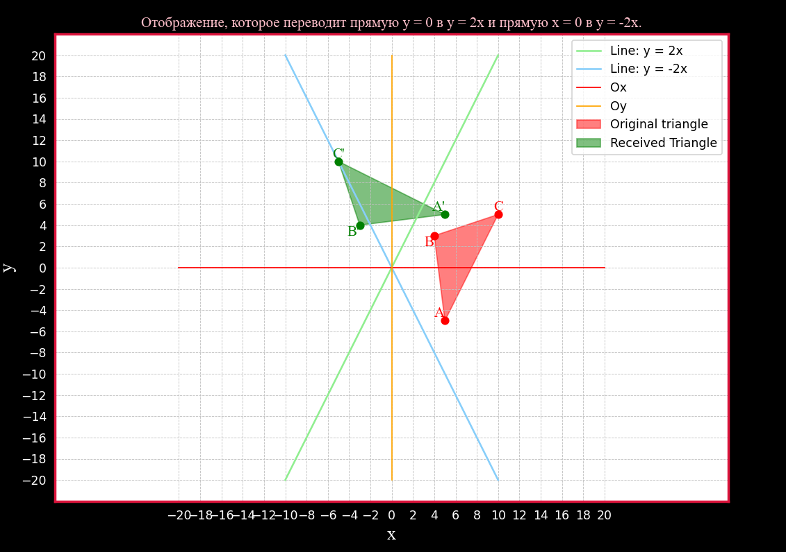

### 💠 Отображение 7: Отображение, которое переводит прямую y = 2x в y = 0 и прямую y = -2x в x = 0.
🔸`y = 2x` - Зереный 

🔸`y = -2x` - Синий 

🔸Преобразование

| Начальный треугольник | Треугольник после отображения |
|------------|------|
| `A(5, -5)` | `A'(-5, -5)` |
| `B(4, 3)`  | `B'(3, -4)`  |
| `C(10, 5)` | `C'(5, -10)` |

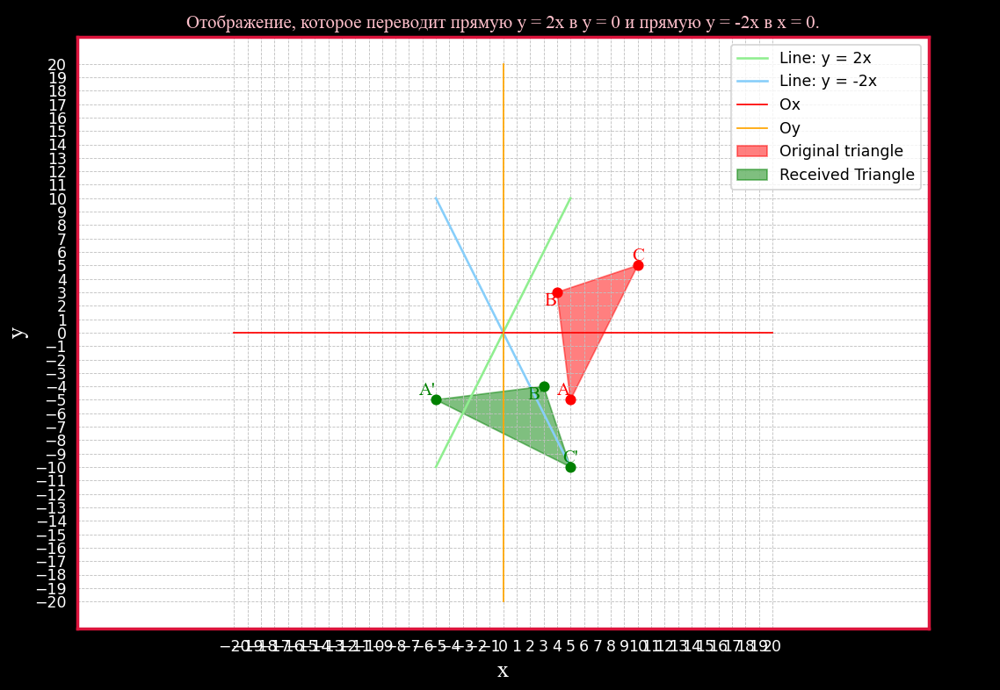

### 💠 Отображение 8: Отображение, которое меняет местами прямые y = 2x и y = -2x.
🔸`y = 2x` -  Красный

🔸`y = -2x` - Синий 

🔸Преобразование

| Начальный треугольник | Треугольник после отображения |
|------------|------|
| `A(5, -5)` | `A'(7, 1)`  |
| `B(4, 3)`  | `B'(0, 5)`  |
| `C(10, 5)` | `C'(2, 11)` |

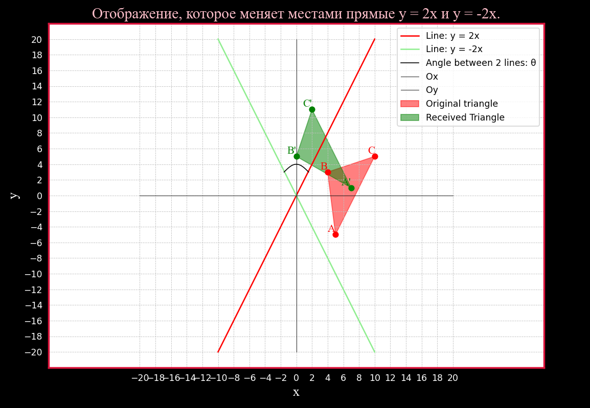

### 💠 Отображение 9: Отображение, которое переводит круг единичной площади с центром в начале координат в круг площади 9.
🔸Круг единичной площади - Красный 

🔸Круг площади 9 - Зеленый

🔸Преобразование

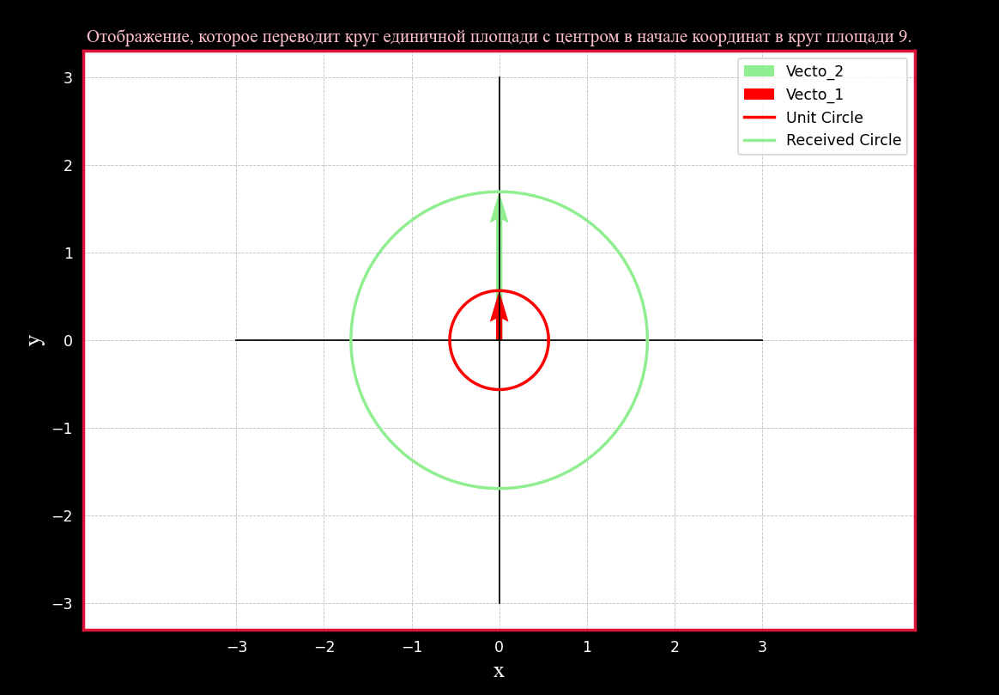

### 💠 Отображение 10: Отображение, которое переводит круг единичной площади с центром в начале координат в некруг площади 6.
🔸Круг единичной площади - Красный 

  🔻Я выбираю любые 3 точки `A`, `B`, `C` на окружности.
  
- Затем выполните отображение и получите равносторонний треугольник.
    
🔸Треугольник площади 6 - Зеленый: `A'`, `B'`, `C'`

🔸Преобразование

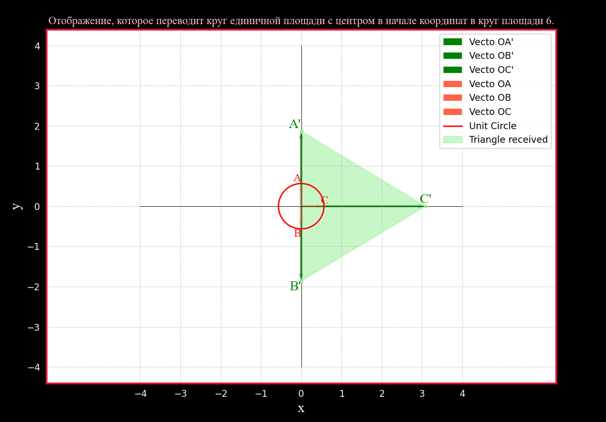

### 💠 Отображение 11: Отображение, у которого собственные вектора перпендикулярны, и ни один из них не лежит на прямой y = 0 или y = x.
🔸Cобственный вектор
-  `v1 = (2, 4)` 
-  `v2 = (-8, 4)`

🔸Преобразование

| Начальный треугольник | Треугольник после отображения |
|------------|------|
| `A(5, -5)` | `A'(0, 15/2)`  |
| `B(4, 3)`  | `B'(7, 5/2)`   |
| `C(10, 5)` | `C'(15, 15/5)` |

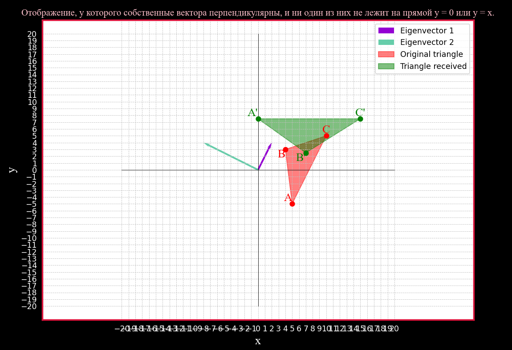

### 💠 Отображение 12: Отображение, у которого нет двух неколлинеарных собственных векторов.
🔸Cобственные векторы
-  `v1 = (-4, 2)` 
-  `v2 = (2, 2)`

🔸Преобразование

| Начальный треугольник | Треугольник после отображения |
|------------|------|
| `A(5, -5)` | `A'(-15, 5)`|
| `B(4, 3)`  | `B'(2, 4)`  |
| `C(10, 5)` | `C'(0, 10)` |

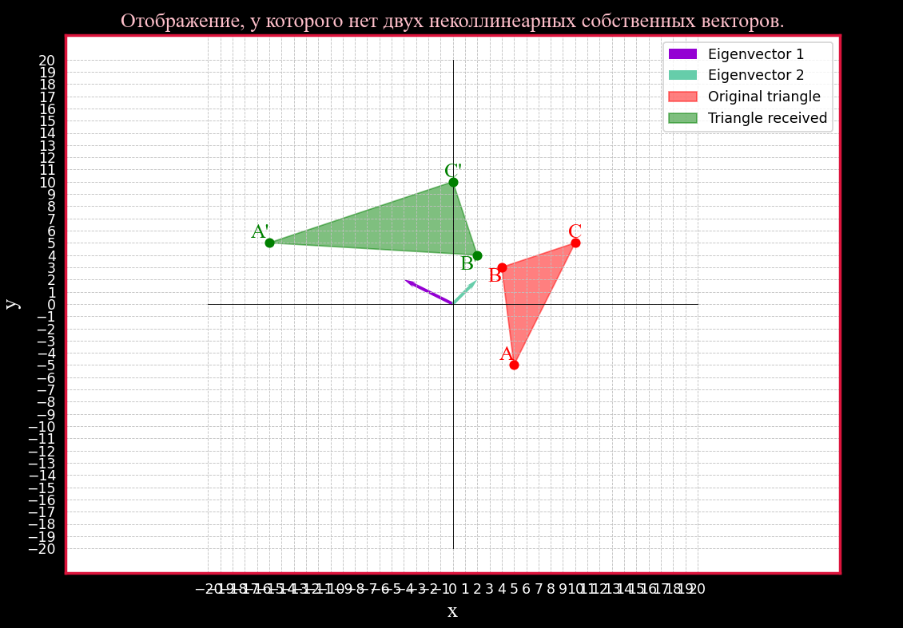

### 💠 Отображение 13: Отображение, у которого нет ни одного вещественного собственного вектора.
🔸Cобственные векторы
-  `v1 = (5, 5)` 
-  `v2 = (-5, 5)`

🔸Преобразование

| Начальный треугольник | Треугольник после отображения |
|------------|------|
| `A(5, -5)` | `A'(0, -10)`|
| `B(4, 3)`  | `B'(7, -1)`  |
| `C(10, 5)` | `C'(15, -5)` |

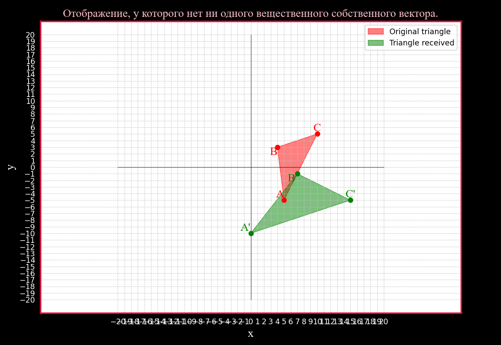

### 💠 Отображение 14: Отображение, для которого любой ненулевой вектор является собственным.
🔸Cобственные векторы
-  `v1 = (-10, -5)` 
-  `v2 = (-10, 5)`
-  `v3 = (5, 10)`
-  `v4 = (5, -10)`

🔸Преобразование

| Начальный треугольник | Треугольник после отображения |
|------------|------|
| `A(5, -5)` | `A'(10, -10)`|
| `B(4, 3)`  | `B'(8, 6)`   |
| `C(10, 5)` | `C'(20, 10)` |

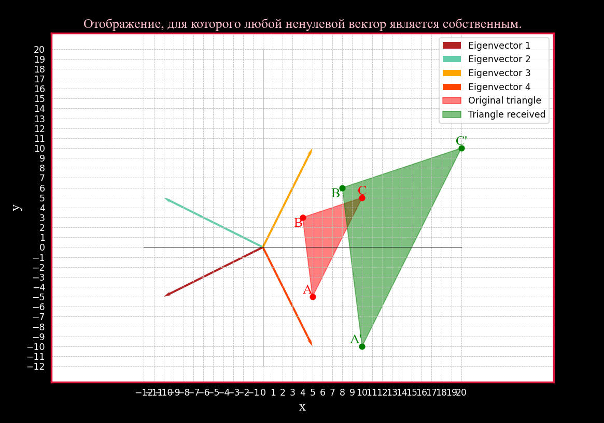

### 💠 Отображение 15: Пару отображений, последовательное применение которых даёт различные результаты в зависимости от порядка: AB ̸= BA.
🔸Cобственные векторы
-  `v1 = (12, 9)` 
-  `v2 = (-9, 12)`

🔸Преобразование

| Начальный треугольник | Треугольник после отображения A | Треугольник после отображения B|Треугольник после отображения AB |Треугольник после  отображения BA|
|------------|------|------|------|------|
| `a(5, -5)` | `a2(-7, 1)` | `a3(7, 1)` | `a23(-5, -5)` | `a32(-17/5, 31/5)` |
| `b(4, 3)`  | `b2(0, 5)`  | `b3(0, 5)` | `b23(-4, 3)`  | `b32(4, 3)`        |
| `c(10, 5)` | `c2(-2, 11)`| `c3(2, 11)`| `c23(-10, 5)` | `c32(10, 5)`       |

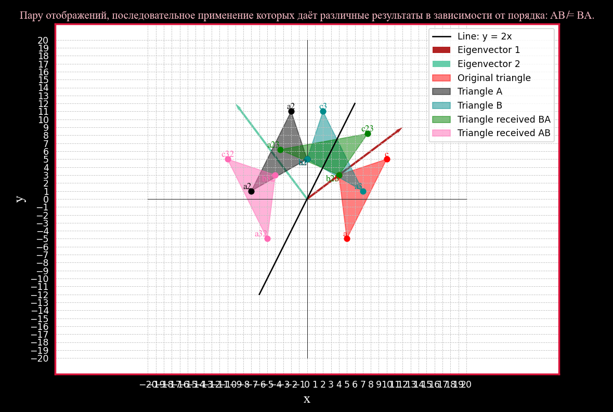

### 💠 Отображение 16: Пару отображений, последовательное применение которых даёт одинаковый результат независимо от порядка: AB = BA.
🔸Cобственные векторы
-  `v1 = (0, 9)` 
-  `v2 = (9, 0)`

🔸Преобразование

| Начальный треугольник | Треугольник после отображения A | Треугольник после отображения B|Треугольник после отображения AB |Треугольник после  отображения BA|
|------------|------|------|------|------|
| `a(5, -5)` | `a2(-5, 5)`  | `a3(5, 5)`  | `a23(-5, -5)` | `a32(-5, -5)` |
| `b(4, 3)`  | `b2(-4, -3)` | `b3(4, -3)` | `b23(4, 3)`   | `b32(4, 3)`   |
| `c(10, 5)` | `c2(-10, -5)`| `c3(10, -5)`| `c23(-10, 5)` | `c32(-10, 5)` |

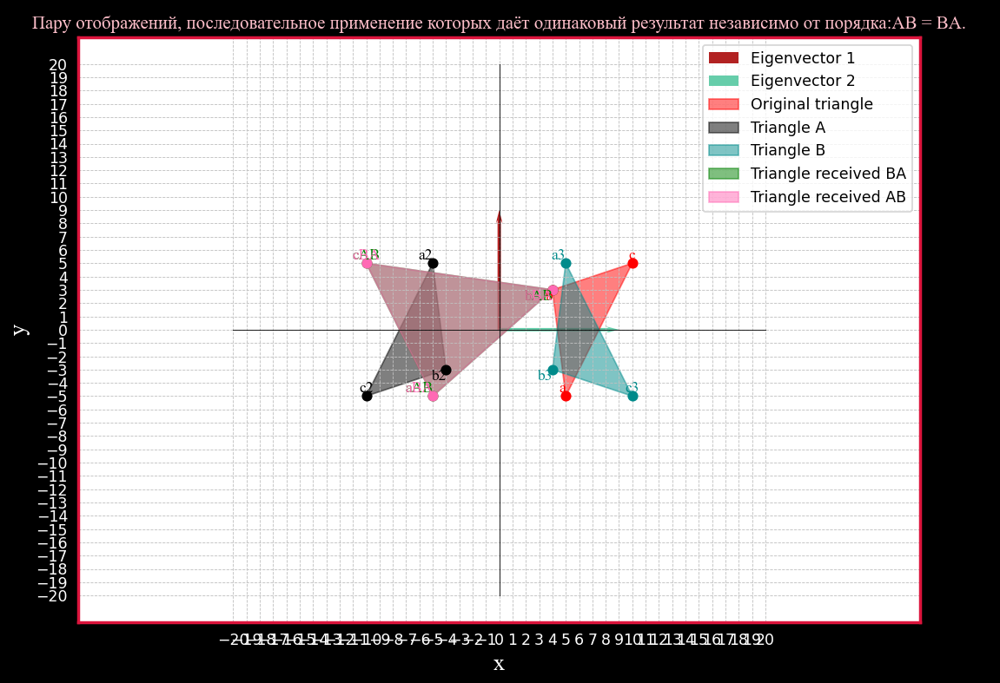
